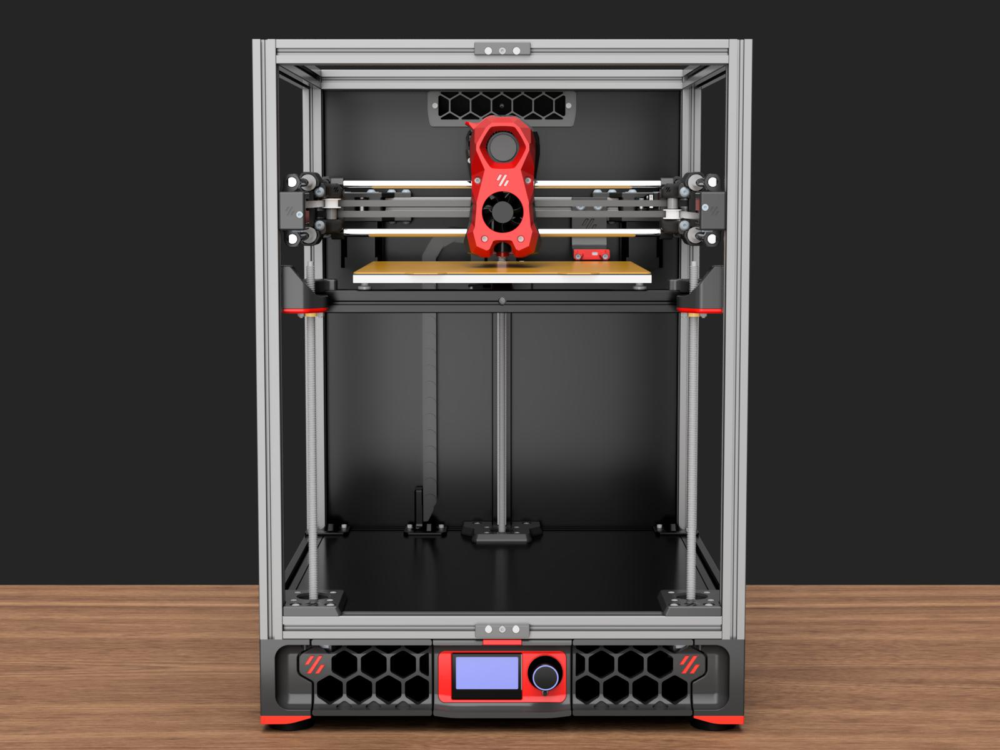
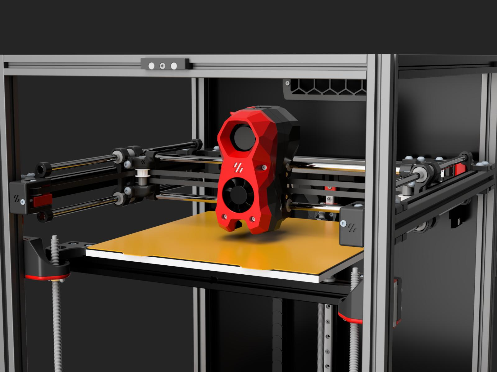

# Legacy Fork

*It's not only a fork of [Voron Legacy](https://github.com/VoronDesign/Voron-Legacy), but also a big "fork" (a.k.a. [Voron Trident](https://github.com/VoronDesign/Voron-Trident)).*

## Features

- Print size: 250mm x 250mm x 250mm.
- Trident 250 with Legacy style gantry.
- Stealthburner toolhead, umbilical wire management (no drag chains).

## BOM

[BOM.md](./BOM.md)

## Recommended Mods

- [PUG (Parametric umbilical gland)](https://www.printables.com/model/378567-pug-parametric-umbilical-gland)
- [Trident Inverted Electronics Bay Mod](https://github.com/VoronDesign/VoronUsers/tree/main/printer_mods/LoganFraser/TridentInvertedElectronics)
- [Print-in-place Panel Latch](https://www.printables.com/model/1042802-sturdy-print-in-place-panel-latch-for-2020-extrusi)
- [Foldable Spool holder](https://www.printables.com/model/1233299-tri-direction-foldable-spool-holder)
- [Sturdy handler](https://www.printables.com/model/793387-voron-24r2trident-sturdy-handler-remix)

## Changelog

### 2025/09/10

Initial release.
