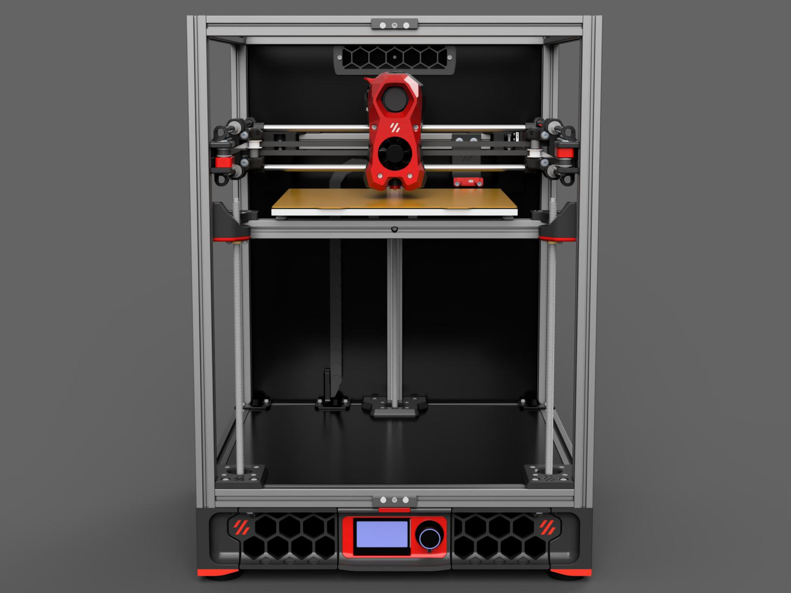
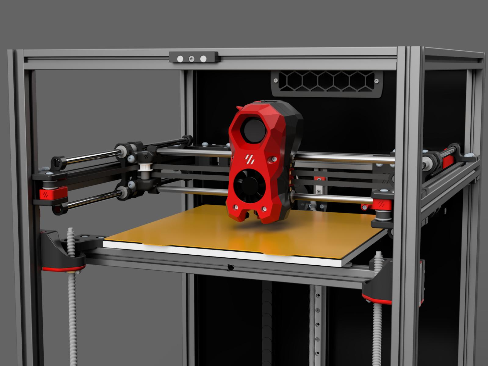

# Legacy Fork

*It's not only a fork of [Voron Legacy](https://github.com/VoronDesign/Voron-Legacy), but also a big "fork" (a.k.a. [Voron Trident](https://github.com/VoronDesign/Voron-Trident)).*

## Features

- Print size: 250mm x 250mm x 250mm.
- Trident 250 with Legacy style gantry.
- [Stealthburner](https://github.com/VoronDesign/Voron-Stealthburner) or [A4T](https://github.com/Armchair-Heavy-Industries/A4T) toolhead, umbilical wire management (no drag chains).
- KlickyNG for Z tilt and bed mesh.

This printer is not design for everyone.
It's just a slightly more "modernized" version of Legacy (also slightly larger print area).
If you're looking for a good reliable printer, build a Trident.

Here's a simple comparison to help you decide:

|                      | Legacy            | Legacy Fork            | Trident               |
| -------------------- | ----------------- | ---------------------- | --------------------- |
| Frame Size (W\*D\*H) | 410 \* 410 \* 410 | 410 \* 410 \* 500      | 410 \* 410 \* 500     |
| Print Area (X\*Y\*Z) | 230 \* 230 \* 240 | **250 \* 250 \* 250**  | **250 \* 250 \* 250** |
| Enclosure            | No                | **Yes**                | **Yes**               |
| Expected Speed/Accel | Lower             | Lower                  | **Higher**            |
| Motion system        | 10 rods           | 6 rods(XY), 3 rails(z) | 6 rails               |

## BOM

[BOM.md](./BOM.md)

## Recommended Mods

- [PUG (Parametric umbilical gland)](https://www.printables.com/model/378567-pug-parametric-umbilical-gland)
- [Trident Inverted Electronics Bay Mod](https://github.com/VoronDesign/VoronUsers/tree/main/printer_mods/LoganFraser/TridentInvertedElectronics)
- [Print-in-place Panel Latch](https://www.printables.com/model/1042802-sturdy-print-in-place-panel-latch-for-2020-extrusi)
- [Foldable Spool holder](https://www.printables.com/model/1233299-tri-direction-foldable-spool-holder)
- [Sturdy handler](https://www.printables.com/model/793387-voron-24r2trident-sturdy-handler-remix)

## Credits

- [Voron Design](https://vorondesign.com/) team for Trident, Legacy, and Stealthburner.
- [Klicky(NG) Probe](https://github.com/jlas1/Klicky-Probe).
- [Voron Construct](https://github.com/PrintersForAnts/Voron-Construct) for handy CAD models.
- [Prusawire](https://www.printables.com/model/1363547-prusawire-2025b1-beta-1) for the belt tensioner design.
- [ApexClips](https://github.com/ApexArray/ApexClips).

> [!TIP]
> Support my work on the following platforms. Thank you!
>
> 
> 

## Changelog

### 2025 / 10 / 21

Use hex nuts instead of heatset inserts to hold the X axis onto XY joints.

### 2025 / 10 / 02

New belt clip and tensioner design.

- Belt tensioner design inspired by [Prusawire](https://www.printables.com/model/1363547-prusawire-2025b1-beta-1).
- [ApexClips](https://github.com/ApexArray/ApexClips)
- Now the front idlers are fixed position.

### 2025 / 09 / 10

Initial release.
